# Semantic Kernel - Introduction and Plugin Development

## What is Semantic Kernel?

**Semantic Kernel** is a lightweight, open-source SDK developed by Microsoft that enables seamless integration of Large Language Models (LLMs) into applications across multiple programming languages (Python, C#, and Java). It acts as middleware between your application code and LLMs, providing a unified interface for orchestrating AI capabilities.

### Key Characteristics:
- **LLM Orchestration**: Manages prompt generation, execution, and LLM interaction automatically
- **Multi-language Support**: Cross-platform SDK available for Python, .NET (C#), and Java
- **Enterprise-Ready**: Built with production scenarios in mind, including security, observability, and scalability
- **Modular Architecture**: Extensible plugin system for adding custom functionality

## Core Components of Semantic Kernel

```mermaid
graph TD
    App["📱 Your Application"]
    
    App -->|"1. Initialize & Configure"| Kernel
    
    Kernel["🧠 Kernel<br/>(Central Orchestrator)"]
    
    Kernel -->|"2. Connect to"| Services
    
    Services["🔌 AI Services<br/>━━━━━━━━━━━━━<br/>• Azure OpenAI<br/>• OpenAI<br/>• Hugging Face<br/>• Custom LLMs"]
    
    Services -->|"3. Load"| Plugins
    
    Plugins["🔧 Plugins<br/>━━━━━━━━━━━━━<br/>Semantic Functions (Prompts)<br/>Native Functions (Code)"]
    
    Plugins -->|"4. Access"| Memory
    
    Memory["💾 Memory & Storage<br/>━━━━━━━━━━━━━<br/>• Vector Databases<br/>• Chat History<br/>• Context Variables"]
    
    Memory -->|"5. Optional"| Planners
    
    Planners["🎯 Planners<br/>━━━━━━━━━━━━━<br/>• Auto Function Calling<br/>• Sequential Planning<br/>• Stepwise Planning"]
    
    Planners -->|"6. Orchestrate"| Plugins
    Plugins -->|"7. Execute via"| Services
    Services -->|"8. Return Results"| Kernel
    Kernel -->|"9. Response"| App
    
    style App fill:#e3f2fd
    style Kernel fill:#e1f5ff
    style Services fill:#fff4e1
    style Plugins fill:#e8f5e9
    style Memory fill:#f3e5f5
    style Planners fill:#fce4ec
```



### 1. **Kernel**
The central orchestrator that manages services, plugins, and execution flow. It coordinates all interactions between your code and AI models.

```python
from semantic_kernel import Kernel
kernel = Kernel()
```

### 2. **Services**
Connectors to various AI backends (Azure OpenAI, OpenAI, Hugging Face, etc.) that provide text generation, embeddings, and other AI capabilities.

```python
from semantic_kernel.connectors.ai.open_ai import AzureChatCompletion
kernel.add_service(AzureChatCompletion(service_id="default"))
```

### 3. **Plugins**
Reusable collections of functions that extend the kernel's capabilities:
- **Semantic Functions**: Prompt-based functions using natural language templates
- **Native Functions**: Python/C#/Java code functions decorated with `@kernel_function`

### 4. **Functions**
Individual units of work that can be:
- **Semantic Functions**: Defined by prompt templates with variables (e.g., `{{$input}}`)
- **Native Functions**: Standard code functions that perform computations, API calls, or data processing

### 5. **Memory & Vector Stores**
Integration with vector databases (Azure AI Search, ChromaDB, Pinecone, etc.) for semantic memory and RAG (Retrieval-Augmented Generation) patterns.

### 6. **Planners** (Advanced)
Automatic orchestration of multiple functions to achieve complex goals through AI-powered planning.

## Semantic Kernel vs. AutoGen

| Feature | Semantic Kernel | AutoGen |
|---------|----------------|---------|
| **Primary Focus** | LLM orchestration & integration framework | Multi-agent conversation framework |
| **Architecture** | Plugin-based, function-centric | Agent-based, conversation-centric |
| **Multi-Agent Support** | Supported (recently added) | Core design principle |
| **Use Cases** | Single-agent apps, RAG, tool integration | Complex multi-agent workflows, debates, collaboration |
| **Flexibility** | Highly modular with plugins | Agent roles and conversation patterns |
| **Learning Curve** | Moderate - function/plugin model | Steeper - agent orchestration concepts |
| **Human-in-the-Loop** | Supported through functions | Built-in conversation patterns |
| **Prompt Engineering** | First-class support with templates | Embedded in agent system messages |
| **Memory Management** | Vector stores, semantic memory | Conversation history within agents |
| **Production Readiness** | Enterprise-focused with Azure integration | Research-oriented, evolving rapidly |

### When to Choose Each:

**Choose Semantic Kernel when:**
- Building single-agent applications with rich tool integration
- Need strong Azure ecosystem integration
- Focusing on prompt engineering and semantic functions
- Require production-ready enterprise features
- Want language-agnostic development (Python, C#, Java)

**Choose AutoGen when:**
- Building complex multi-agent systems with distinct roles
- Need agent collaboration, debate, or consensus mechanisms
- Experimenting with emergent agent behaviors
- Require sophisticated multi-turn conversations between agents
- Working on research or prototyping advanced AI systems

## What This Notebook Demonstrates

This comprehensive tutorial covers the fundamental concepts and advanced features of Semantic Kernel:

### 1. **Initial Setup and Configuration**
- Installing Semantic Kernel SDK
- Configuring Azure OpenAI connection
- Creating and initializing the Kernel

### 2. **Semantic Functions (Prompt-Based)**
- **File-Based Plugins**: Loading plugins from directory structure with `skprompt.txt` and `config.json`
- **Inline Functions**: Creating prompt templates directly in code
- Using prompt variables like `{{$input}}` and custom parameters
- Configuring execution settings (temperature, max_tokens, etc.)

### 3. **Native Functions (Code-Based)**
- Creating Python classes with `@kernel_function` decorators
- Using type annotations with `Annotated` for parameter descriptions
- Building reusable plugin classes
- Calling native functions from within semantic functions

### 4. **Chat Experiences**
- Building conversational AI with `ChatHistory`
- Managing conversation context with `KernelArguments`
- Implementing multi-turn dialogues
- Maintaining conversation state across interactions

### 5. **Groundedness Checking Pipeline**
- Extracting entities from generated text
- Verifying entities against reference/grounding text
- Removing ungrounded information (hallucinations)
- Three-step grounding workflow: Extract → Check → Excise

### 6. **Streaming and Multiple Completions**
- Generating multiple responses per prompt
- Configuring `number_of_responses` parameter
- Useful for A/B testing and evaluating prompt robustness

### 7. **Plugin Architecture Patterns**
- Organizing plugins in directory structures
- Combining semantic and native functions
- Function composition and chaining
- Parameter passing between functions

## Project Structure

```
Lab2_Exploring Al Agentic Frameworks- Semantic Kernel with Plugins/
├── 03-IntroductiontoSemanticKernel.ipynb    # Main tutorial notebook
├── services.py                              # Service configuration utilities
└── plugins/
    ├── GroundingPlugin/                     # Entity grounding functions
    │   ├── ExtractEntities/
    │   ├── ReferenceCheckEntities/
    │   └── ExciseEntities/
    └── Summarizer/                          # Text summarization plugin
        └── summarize/
```

## Getting Started

### Prerequisites
```bash
pip install semantic-kernel
```

### Basic Example
```python
from semantic_kernel import Kernel
from semantic_kernel.connectors.ai.open_ai import AzureChatCompletion

# Initialize kernel
kernel = Kernel()

# Add AI service
kernel.add_service(AzureChatCompletion(service_id="default"))

# Load plugin
plugin = kernel.add_plugin(parent_directory="./plugins", plugin_name="Summarizer")

# Invoke function
result = await kernel.invoke(plugin["summarize"], input="Your text here...")
print(result)
```

## Key Takeaways

1. **Semantic Kernel is a framework, not a chatbot** - It provides the infrastructure for building AI-powered applications
2. **Functions are the building blocks** - Both prompt-based (semantic) and code-based (native) functions work together
3. **Plugins enable modularity** - Organize related functions into reusable plugins
4. **Context management is crucial** - Use `KernelArguments` and `ChatHistory` to maintain state
5. **Groundedness matters** - Always verify LLM outputs against source material for factual accuracy

## Additional Resources

- [Semantic Kernel GitHub Repository](https://github.com/microsoft/semantic-kernel)
- [Official Documentation](https://learn.microsoft.com/en-us/semantic-kernel/)
- [Semantic Kernel Discord Community](https://aka.ms/sk-discord)
- [Sample Applications](https://github.com/microsoft/semantic-kernel/tree/main/samples)
